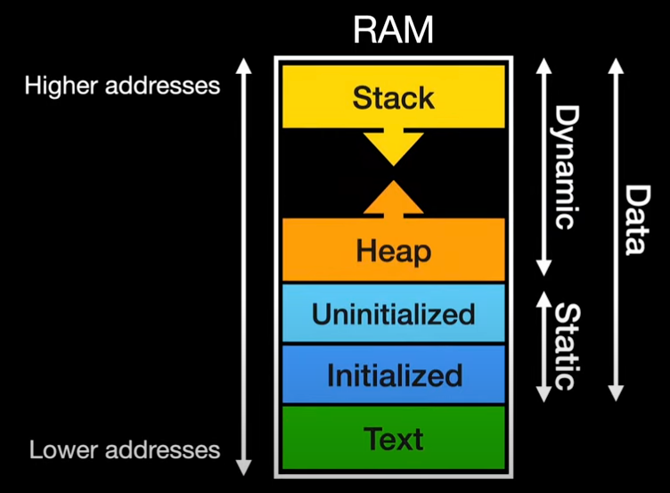

# C language examples
This repository contains various examples of C programming language code snippets and projects. Each example is designed to demonstrate different features and functionalities of the C language.

저는 현장에서 java, c#, javascript, python 등 다양한 언어를 사용하고 있지만, 가장 기본이 되는 언어는 C언어라고 생각합니다.
C언어는 시스템 프로그래밍, 임베디드 시스템, 운영체제 개발 등 다양한 분야에서 사용되며, 다른 언어의 기초가 되는 중요한 언어입니다.
따라서 C언어를 잘 이해하고 활용하는 것은 프로그래밍 전반에 큰 도움이 됩니다.
이 저장소는 C언어의 다양한 예제를 통해 학습하고자 하는 분들에게 도움이 되고자 합니다.

---

```
# project structure
    cEx/
    ├── src/
    │   ├── main.c
    │   ├── hello.c
    │   ├── data_typesEx.c
    │   └── ... (모든 .c 파일)
    ├── include/
    │   ├── hello.h
    │   ├── data_typesEx.h
    │   └── ... (모든 .h 파일)
    ├── bin/
    │   └── (비어 있음)
    ├── Makefile
    ├── Makefile.mk
    └── README.md
    ...

```


## Contents
- [Hello World](hello.c)
- [Data Types](data_typesEx.c)
- [Functions](functionsEx.c)
- [Pointers](pointersEx.c)
- [Arrays](arraysEx.c)
- [Structures](structuresEx.c)
- [Unions](unionsEx.c)
- [Enums](enumsEx.c)
- [Typedefs](typedefsEx.c)
- [Memory Management](memory_managementEx.c)
- [File I/O](file_ioEx.c)
- [Dynamic Memory Allocation](dynamic_memoryEx.c)
- [Dynamic 2D Array Allocation](dynamic_2d_arrayExEx.c)
- [Stack Data Structure](stackEx.c)
- [Queue Data Structure](queueEx.c)
- [Linked List Structure](linked_listEx.c)
- [Double Linked List](double_linked_listEx.c)
- [Circular Linked List](circular_linked_listEx.c)
- [Binary Trees](binary_treesEx.c)
- [Hash Tables](hash_tablesEx.c)
- [Graphs](graphsEx.c)
- [Searching Algorithms](searchingEx.c)
- [Sorting Algorithms](sortingEx.c)
- [Recursion Examples](recursion_examplesEx.c)
- [Bit Manipulation](bit_manipulationEx.c)
- [Preprocessor Directives](preprocessorEx.c)
- [Error Handling](error_handlingEx.c)
- [Multithreading](multithreadingEx.c)
- [Networking](networkingEx.c)
- [Socket Programming](socket_programmingEx.c)
- [Snake Game](snake_gameExEx.c)
- [Tetris Game](tetris_gameExEx.c)
- [Breakout Game](breakout_gameExEx.c)
- [Makefile Example](Makefile)
- [README](README.md)


---

## compile and run
To compile and run the examples, you can use the following commands in your terminal:

```bash
$ make           # This will compile all examples and create the 'main' executable
$ make copy_main # This will copy the 'main' executable to the current directory
$ ./main     # This will run the main example
```

## Getting Started
1. Clone the repository to your local machine.
2. Navigate to the directory containing the examples.
3. Compile all example using `make` command.
4. Run the compiled executable ( ./main ) to see the output.
---

## 📋 프로젝트 개요

이 프로젝트는 **C 언어 학습을 위한 종합 예제 모음집**입니다. 다양한 C 프로그래밍 개념과 기능을 실습할 수 있도록 구성되어 있습니다.

### 🎯 주요 특징

#### 1. 인터랙티브 메뉴 시스템
- `main.c`는 데이터 기반 메뉴 시스템을 구현
- 함수 포인터 배열(`MenuItem` 구조체)을 사용하여 35개의 예제를 관리
- 사용자가 번호를 선택하면 해당 예제가 실행되는 방식
- 새로운 예제 추가 시 `menu_items` 배열에 한 줄만 추가하면 됨

#### 2. 포괄적인 학습 내용

**기초 개념:**
- Hello World, Data Types, Functions, Pointers, Arrays
- Structures, Unions, Enums, Typedefs

**메모리 관리:**
- Memory Management
- Dynamic Memory Allocation
- Dynamic 2D Array Allocation

**자료구조:**
- Stack, Queue
- Linked List (단일, 이중, 원형)
- Binary Trees
- Hash Tables
- Graphs

**알고리즘:**
- Searching Algorithms (검색)
- Sorting Algorithms (정렬)
- Recursion Examples (재귀)

**고급 주제:**
- File I/O
- Bit Manipulation
- Preprocessor Directives
- Error Handling
- Multithreading (멀티스레딩)
- Networking Basics
- Socket Programming

**실전 프로젝트:**
- 🐍 Snake Game
- 🎮 Tetris Game
- 🧱 Breakout Game
- 📋 Task Management System

### 🛠️ 빌드 시스템

**Makefile 구성:**
- **컴파일러**: `clang`
- **컴파일 플래그**:
  - `-Wall`: 모든 경고 활성화
  - `-g`: 디버깅 정보 포함
  - `-pthread`: 멀티스레딩 지원
  - `-Iinclude`: 헤더 파일 경로 지정

**자동 빌드 프로세스:**
- `src/` 디렉터리의 모든 `.c` 파일을 자동으로 탐지
- 각 소스 파일을 `bin/` 디렉터리에 오브젝트 파일(`.o`)로 컴파일
- 모든 오브젝트 파일을 링크하여 최종 실행 파일 `bin/main` 생성

### 💡 설계 철학

1. **모듈화**: 각 주제별로 독립적인 `.c`/`.h` 파일 쌍으로 구성
2. **확장성**: 새로운 예제 추가가 용이한 데이터 기반 아키텍처
3. **크로스 플랫폼**: Windows(`cls`)와 Unix/macOS(`clear`) 모두 지원
4. **실용성**: 이론뿐만 아니라 실제 게임과 네트워크 프로그래밍까지 포함

### 📊 프로젝트 통계

- **총 소스 파일**: 36개 (.c 파일)
- **총 헤더 파일**: 37개 (.h 파일)
- **예제 개수**: 35개
- **게임 프로젝트**: 3개 (Snake, Tetris, Breakout)

---

