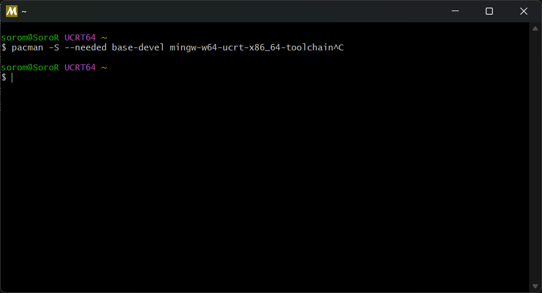

# Exercising C language on windows os


1. Download IDE [Dev-C++](https://sourceforge.net/projects/orwelldevcpp/) 
   and use Dev-C++ for c-language coding
or 
   <br>
2. Download [msys2-x86_64-20250622.exe](https://www.msys2.org/) and install it at C:\msys64
   and we can see command console window after installing it like the below;
   ---
   

   ---
   <br>
   가. Install MSYS2 and Mingw-w64
   ```bash
      ## install mingw-w64-ucrt-x86_64-toolchain (in msys2 terminal)  
      pacman -S --needed base-devel mingw-w64-ucrt-x86_64-toolchain
   ```

   
   Enter selection default all (choose default Enter)
   Proceed with installation? [Y/n] Y
   
   

   ---
   <br>
   나. Add to System PATH
   copy the path of C:\msys64\ucrt64\bin
   

   add path variable
   

   ---
   <br>
   다. Verify Installation (check gcc installed in cmd terminal)
   

   ---
   <br>
   라. VS Code Setup
      > Install these extensions:
      >>
      > -  C/C++ by Microsoft
      > - C/C++ Extension Pack
      > - Code Runner (optional)
   <br>
   <br>
   install c/c++ extension in vsCode 
   
      

   ---
   <br>
   마. Create a Simple C Program (ex: main.c)


   
   ```bash
   main.c file shall be 
      |- ( preprocessing: gcc -E main.c -o main.i )
      |- main.i // this file is preprocessed file
            |- ( compiling: gcc -S main.i -o main.s   or  gcc -S main.c -o main.s )
            |- main.s // this file is assemblier file fiting of the current OS
               |- ( assembling: gcc -c main.s -o main.o or gcc -c main.c -o main.o )
               |- main.o // this file is machine readable binary file
                     |- ( Linking: gcc main.o -o executable or gcc main.c -o executable )
                     |- main.exe // this file is runnable file by windows os
   ```