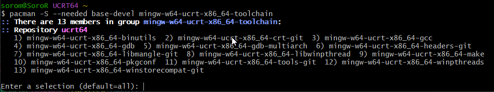
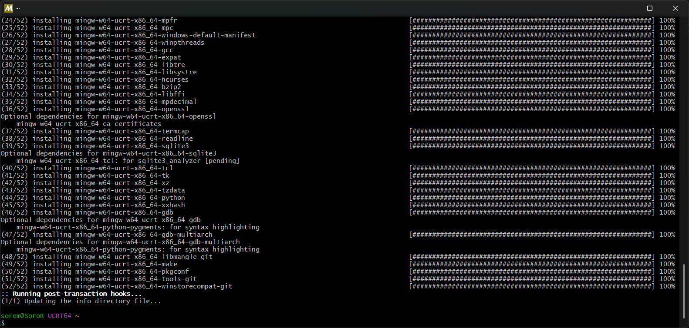
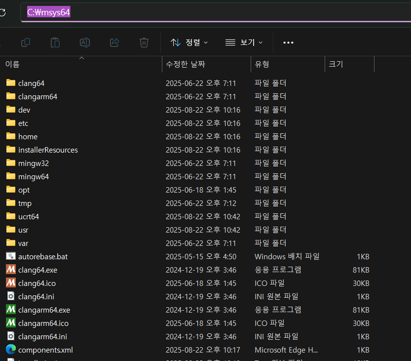
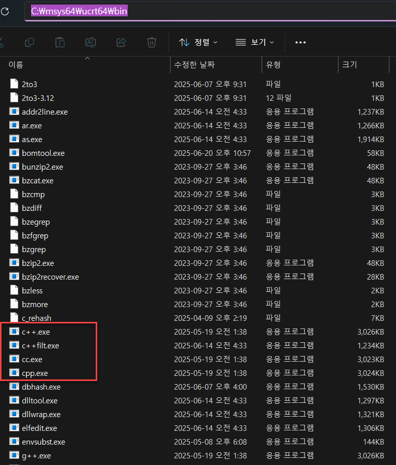
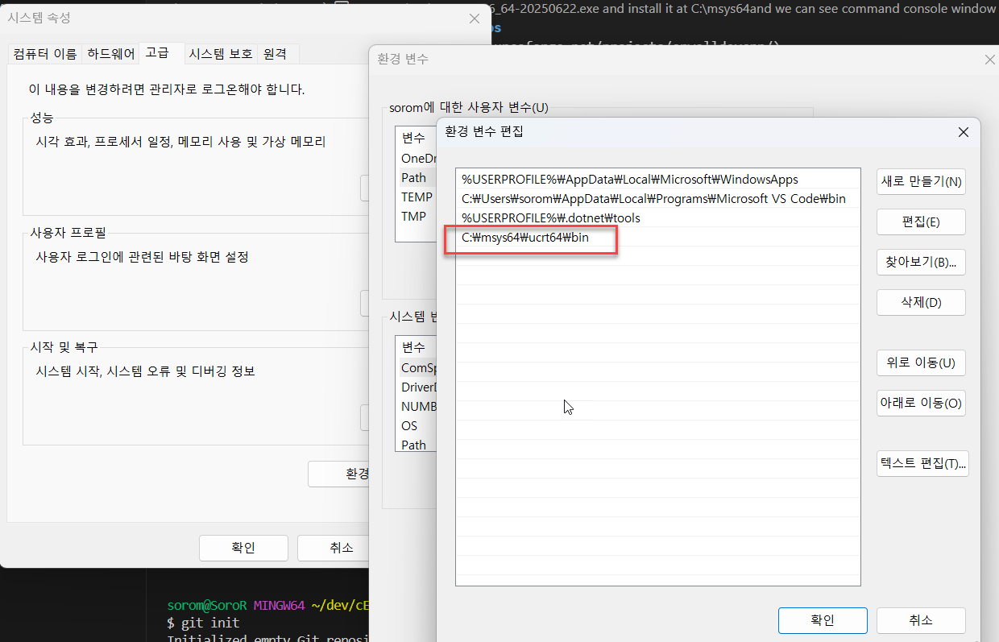
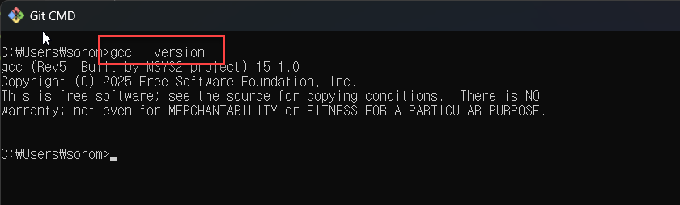
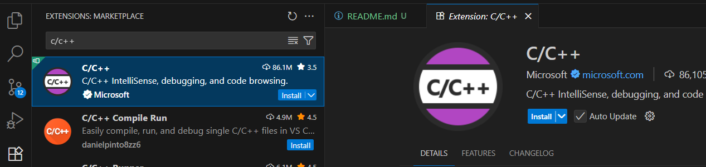

# Exercising C language on windows os
---

1. Download IDE [Dev-C++](https://sourceforge.net/projects/orwelldevcpp/) 
   and use Dev-C++ for c-language coding
or 
   ---
1. Download [msys2-x86_64-20250622.exe](https://www.msys2.org/) and install it at C:\msys64
   and we can see command console window after installing it like the below;
   ---
   

   ```bash
      ## install mingw-w64-ucrt-x86_64-toolchain (in msys2 terminal)  
      pacman -S --needed base-devel mingw-w64-ucrt-x86_64-toolchain
   ```

   
   Enter selection default all (choose default Enter)
   Proceed with installation? [Y/n] Y
   
   

   copy the path of C:\msys64\ucrt64\bin
   

   add path variable
   

   check gcc installed in cmd terminal
   

   install c/c++ extension in vsCode 
   
